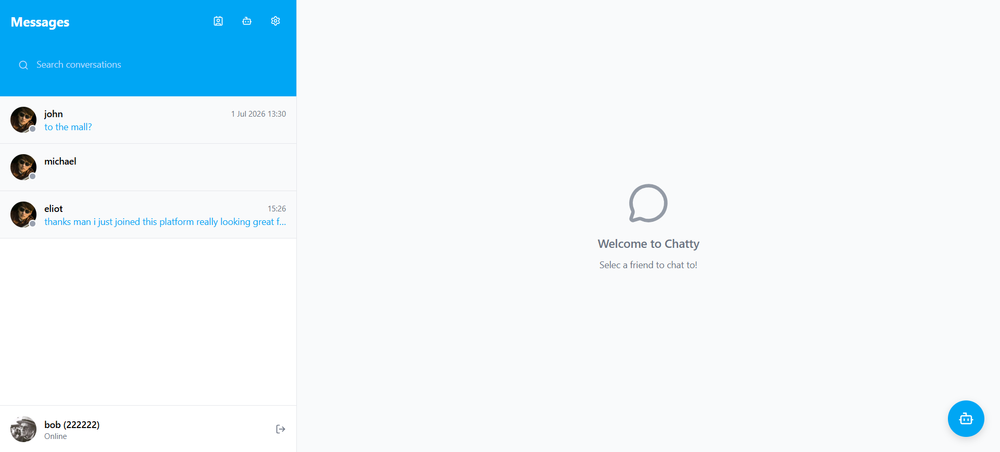
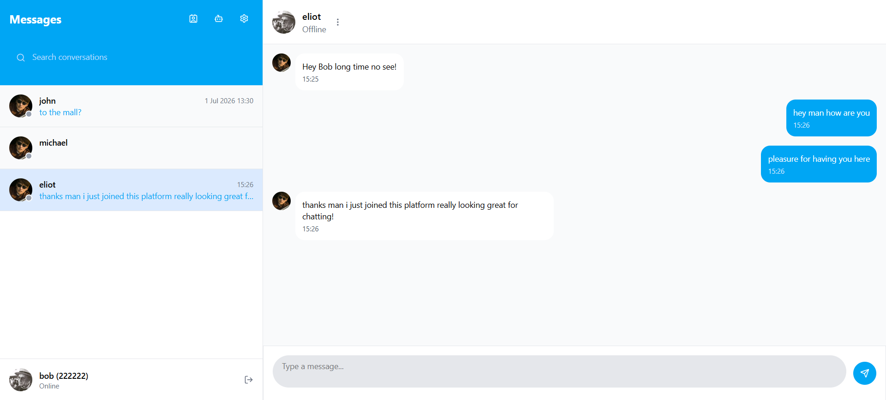
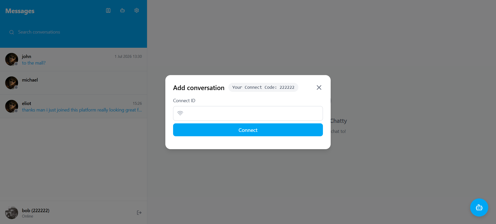
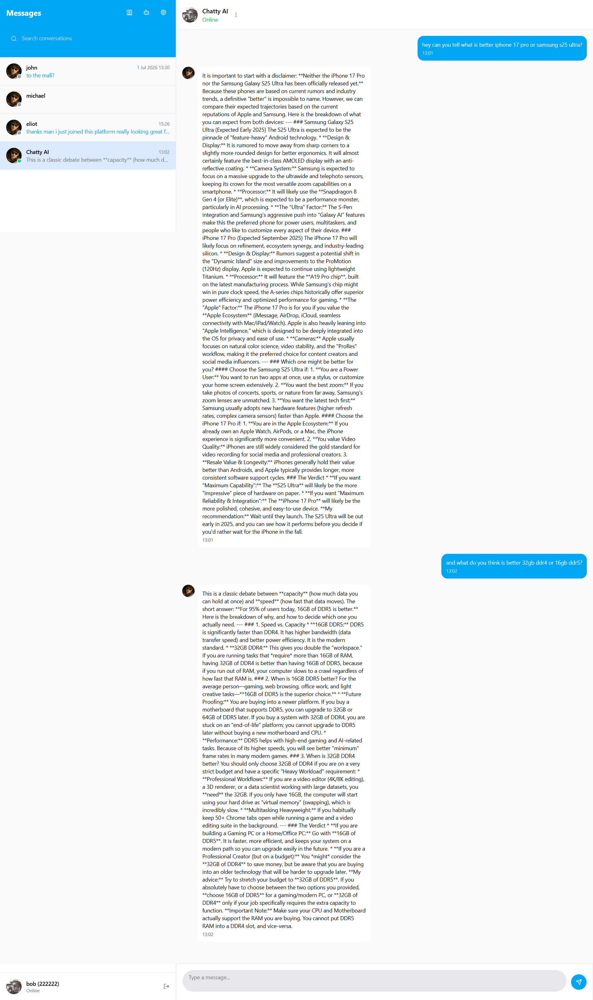

# 💬 Chatty — Real-Time Communication Platform

<p align="center">
  <strong>A real-time chat platform built with React, Node.js, Socket.IO, Redis and Google AI.</strong>
</p>

<p align="center">
  Users can connect through unique Connect Codes, chat in real time, track online presence, receive notifications and interact with an AI assistant.
</p>

<p align="center">

[](https://react.dev/)
[](https://nodejs.org/)
[](https://socket.io/)
[](https://redis.io/)
[](https://www.mongodb.com/)
[](https://www.docker.com/)

</p>

---

## 📸 Screenshots

### Dashboard



### Real-Time Chat



### Connect Codes



### AI Assistant



---

## ✨ Features

* 🔐 **JWT Authentication** — Secure authentication using HTTP-only cookies
* ⚡ **Real-Time Messaging** — Instant communication powered by Socket.IO
* 🔑 **Connect Codes** — Connect with other users using unique codes
* 👥 **Friend System** — Send, accept and manage friend requests
* 🟢 **Online Presence** — Real-time online/offline status
* 🔔 **Real-Time Notifications** — Instant notifications for user activity
* ✓ **Read Receipts** — Track message status
* ⌨️ **Typing Indicators** — See when another user is typing
* 🤖 **AI Assistant** — Integrated Google AI conversational assistant
* 🔴 **Redis Sessions** — Track multiple active Socket.IO sessions per user
* 🐳 **Docker** — Containerized development and deployment environment

---

## 🏗️ Architecture

```text
                    ┌────────────────────┐
                    │   React + TS       │
                    │     Frontend       │
                    └─────────┬──────────┘
                              │
                       REST / WebSocket
                              │
                              ▼
                    ┌────────────────────┐
                    │  Node.js / Express │
                    │      Backend       │
                    └──────┬─────┬───────┘
                           │     │
                ┌──────────┘     └──────────┐
                ▼                           ▼
          ┌──────────┐                ┌──────────┐
          │ MongoDB  │                │  Redis   │
          │  Data    │                │ Sessions │
          └──────────┘                │ Presence │
                                      └──────────┘
                                          
                              │
                              ▼
                       ┌─────────────┐
                       │  Google AI  │
                       │ AI Assistant│
                       └─────────────┘
```

### Redis Presence

Redis stores active Socket.IO sessions using:

```text
user:{userId}:sessions
```

Each user can have multiple active sessions. The application uses Redis Sets to track socket IDs and determine whether a user is currently online.

---

## 🛠️ Tech Stack

**Frontend**

* React
* TypeScript
* Socket.IO Client

**Backend**

* Node.js
* Express
* Socket.IO
* JWT

**Database & Infrastructure**

* MongoDB
* Redis
* Docker

**AI**

* Google AI

---

## 🚀 Getting Started

### 1. Clone

```bash
git clone https://github.com/AmarKajevic/Chat-app-socket.io-.git

cd Chat-app-socket.io-
```

### 2. Environment Variables

Create a `.env` file:

```env
PORT=
CLIENT_ORIGIN=
MONGO_URI=
JWT_SECRET=
REDIS_URI=
GOOGLE_API_KEY=
```

### 3. Run with Docker

```bash
docker compose up --build
```

Or run the frontend and backend separately using the project's package scripts.

---

## 🔮 Future Improvements

* Horizontal Socket.IO scaling with Redis Adapter
* Message pagination
* File and image sharing
* Push notifications
* AI conversation memory
* Automated testing
* Production monitoring

---

## 👨‍💻 Author

**Amar Kajevic**

Full-Stack Developer focused on React, Next.js, Node.js, TypeScript, real-time applications and distributed systems.

### Featured Projects

**[Vendora](https://github.com/AmarKajevic/Vendora-Multi-vendor-ecommerce-platform)**
Multi-vendor e-commerce platform with Kafka, Redis, Stripe, TensorFlow, Docker and CI/CD.

**[Chatty](https://github.com/AmarKajevic/Chat-app-socket.io-)**
Real-time communication platform with Socket.IO, Redis and AI.
